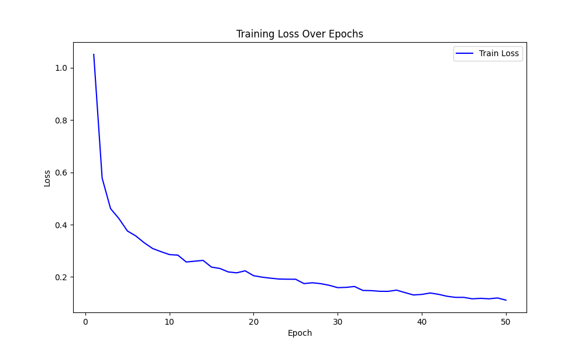
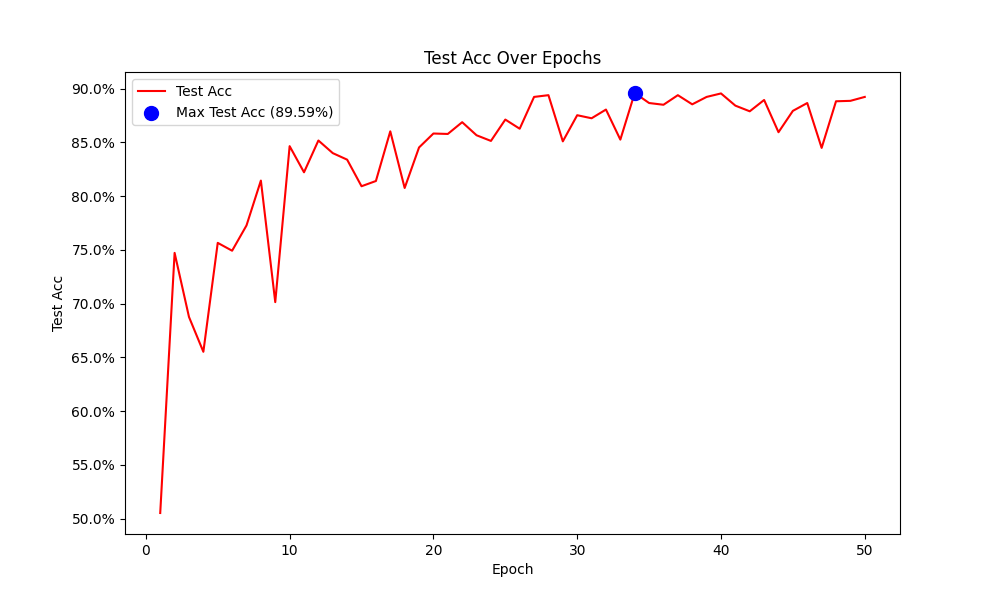

# DGCNN 3D点云分类

[English](readme_zh)  /  中文

↑ Click the link above to switch languages

本项目通过 **DGCNN** 框架 实现了一个较为精准的3D点云分类任务

由于设备受限 本项目没有按照DGCNN的官方建议的标准参数设置 而是进行了k值的减少和采样点的随机化等 减少了模型的计算复杂度 但50epochs的最高准确率也达到了89.59% 如果优化了参数设置 准确率应该可以达到91-92%左右 

下图展示了该模型在训练过程中训练损失的变化趋势



下图展示了该模型在训练过程中测试集准确率的变化趋势



**训练时长参考** 

## 目录

- [环境配置](#环境配置)
- [多语言支持](#多语言支持)
- [数据集](#数据集)
- [文件结构](#文件结构)
- [许可证](#许可证)
- [贡献](#贡献)

## 环境配置

```
CUDA 12.1
Python 3.9.13
PyTorch 2.1.0
torch-geometric 1.6.3
torch-cluster 1.6.3
h5py 3.12.1
numpy 1.24.3
pandas 2.2.3
matplotlib 3.9.2
```


## 多语言支持

为了让不同语言背景的开发者更容易理解代码 本项目的注释提供了英文和中文两种版本

## 数据集

本项目使用的ModelNet40数据集是经过处理并保存为hdf5格式的版本 来源于 [GitHub](https://github.com/antao97/PointCloudDatasets)

## 文件结构

项目的文件结构如下

```
3D_Classification_DGCNN/
│
├── model/ 
│   └── model.pt
│
├── plot/ 
│   ├── acc_plot.png
│   ├── loss_plot.png
│   └── plot.ipynb
│
├── utils(en/zh)/
│   ├── data/ 
│   │    └── modelnet40_hdf5_2048 (自行下载)
│   ├── dataloader.py
│   ├── DGCNN.py
│   ├── EdgeConvfeature.ipynb
│   └── train.py
│
├── train.csv
├── readme.md
└── main.py 
```

## 许可证

本项目使用 MIT 许可证。有关详细信息，请参阅 [LICENSE](LICENSE) 文件。

## 贡献

欢迎所有形式的贡献！无论是报告错误还是提出建议 非常感谢！！
